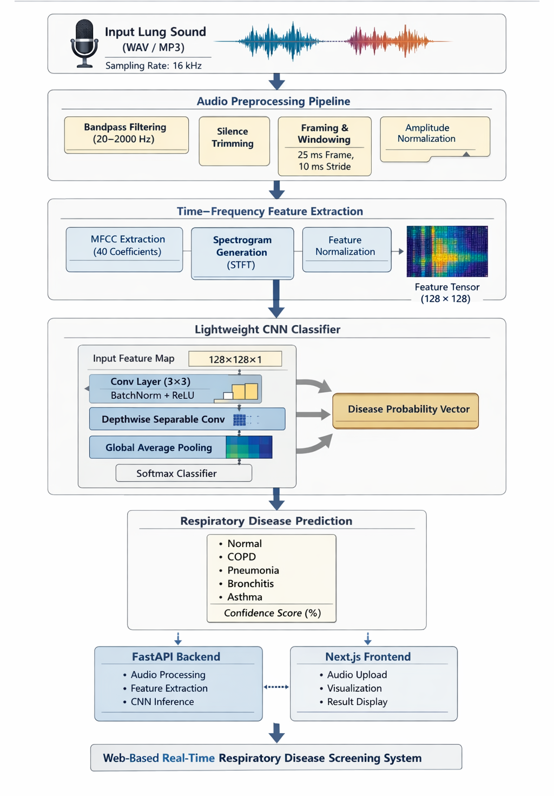
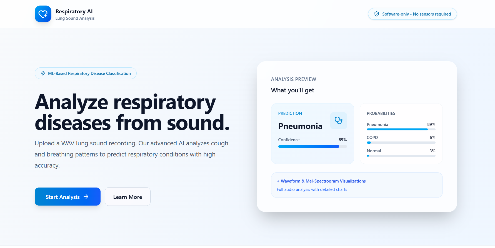
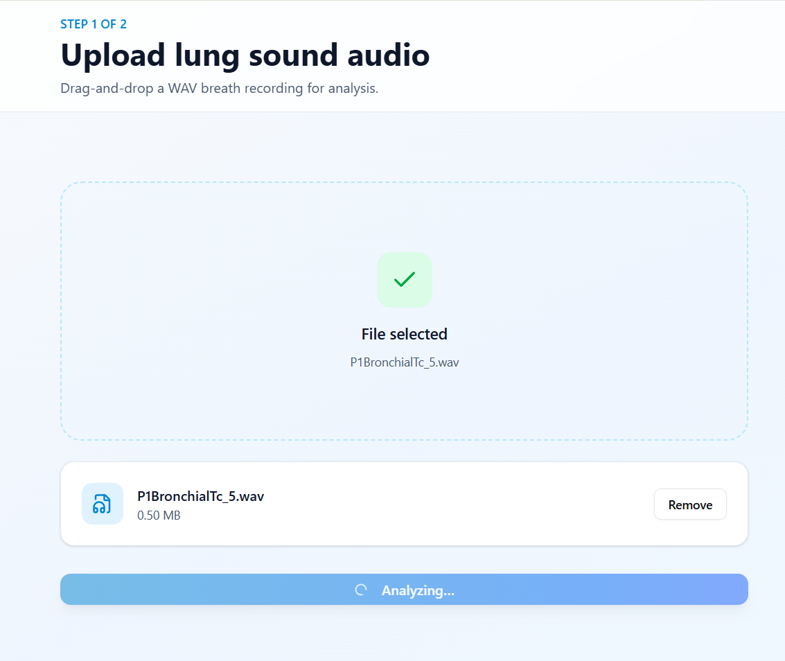
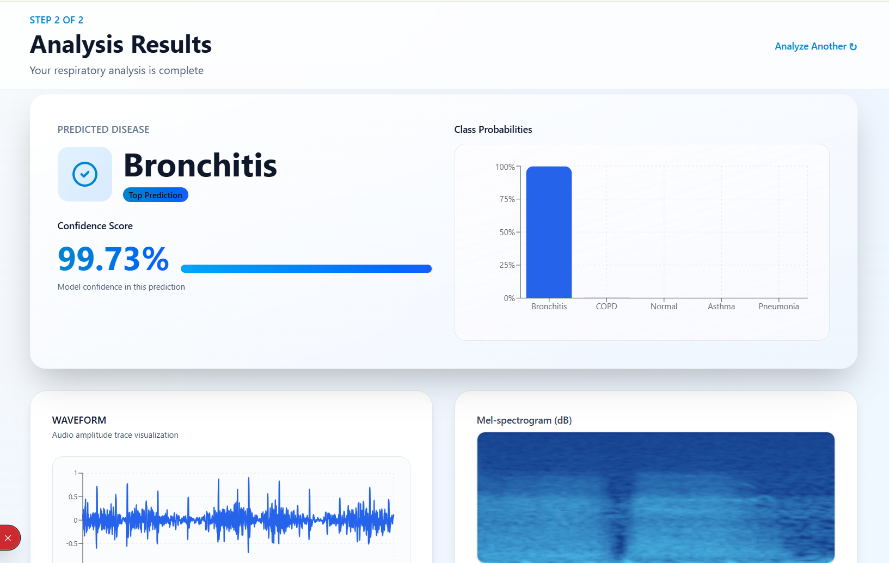
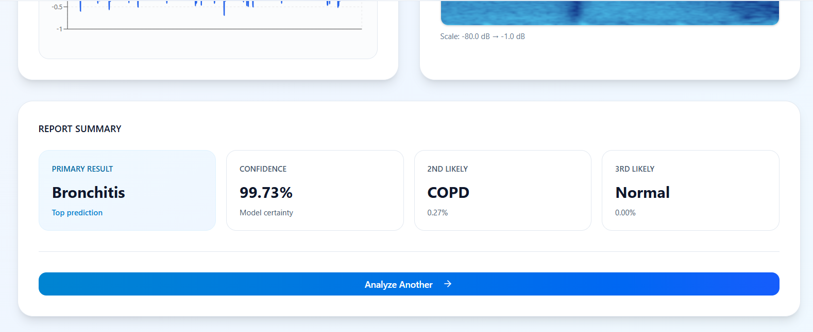

# 🫁 AI Lung Disease Detection System

An AI-powered system that analyzes **lung sound recordings** and predicts respiratory conditions using **Deep Learning** and **audio signal processing**.

This project demonstrates how machine learning can assist healthcare by identifying abnormal respiratory sounds such as **crackles and wheezes** from audio recordings.

---

#  Project Overview

Respiratory diseases require early diagnosis for effective treatment. Lung sound recordings contain patterns that can indicate abnormalities.

This project uses a **Convolutional Neural Network (CNN)** to classify lung sound recordings and predict possible respiratory conditions.

Main components of the system:

• Audio preprocessing pipeline
• Feature extraction from lung sounds
• CNN model for classification
• Backend API for predictions
• Web interface for audio upload and results

---

#  System Architecture

The system processes lung sound recordings through multiple stages:

1. Audio upload from the user interface
2. Audio preprocessing and noise handling
3. Feature extraction using MFCCs
4. CNN model prediction
5. Display predicted respiratory condition

---

#  Application Demo

## Web Interface

Users can upload respiratory sound recordings through a simple web interface.

---

## Upload & Processing

The audio file is sent to the backend where preprocessing and feature extraction are performed.

---

## Prediction Result

The trained CNN model analyzes the sound pattern and predicts the respiratory condition. Results predicted result with confidental score.

---

#  Tech Stack

**Programming Language**

* Python

**Machine Learning**

* TensorFlow / Keras
* NumPy
* Pandas
* Librosa (Audio Processing)

**Backend**

* FastAPI

**Deployment**

* Docker

---

#  Project Structure

backend
│
├── ml
│   ├── preprocess.py
│   ├── features.py
│   ├── modeling.py
│   ├── train.py
│   └── predict.py

├── model
│   └── model.h5

├── main.py
├── requirements.txt
└── Dockerfile

---

#  Running the Project

### Clone the repository

git clone
https://github.com/Suruthi-Vijaya02/ML-lung-disease-classifier

---

### Navigate to backend

cd ML-lung-disease-classifier/backend

---

### Install dependencies

pip install -r requirements.txt

---

### Run the API

python main.py

---

#  Dataset

The project uses respiratory sound recordings from the **ICBHI Lung Sound Dataset**, a publicly available dataset used for respiratory disease research.

---

#  Future Improvements

• Improve model accuracy with larger datasets
• Add real-time lung sound recording
• Deploy full system in cloud environment
• Enhance UI for clinical usability

---

**Suruthi Vijaya**

AI / Machine Learning Enthusiast

GitHub
https://github.com/Suruthi-Vijaya02
